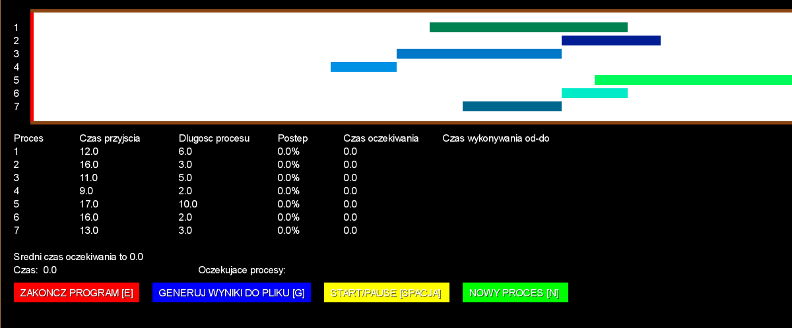
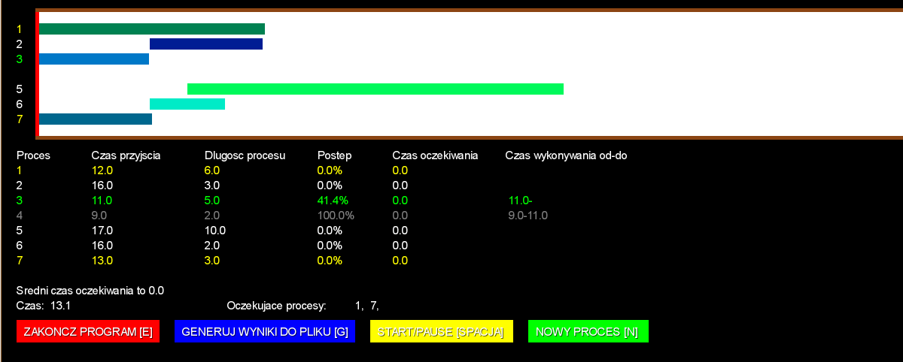

# ProcessSimulation

CPU time scheduling simulation program: FCFS, SJF, RoundRobin algorithms. 

Application developed in Java and libGDX framework.

## Table of contents
* [ProcessSimulation](#processsimulation)
	* [Technologies](#technologies)
	* [Setup](#setup)
	* [Usage](#usage)
	* [Structure of source code](#structure-of-source-code)
	* [Implementation of processor time planning algorithms](#implementation-of-processor-time-planning-algorithms)
	* [Project report](#project-report)

## Technologies

* Java
* libGDX framework: https://libgdx.com/

## Setup

The project was generated by [Project Setup Tool](https://libgdx.com/dev/project-generation/). Also libGDX projects are [Gradle](http://www.gradle.org/) projects, which makes managing dependencies and building considerably easier.

You can download project's files from this repository. Then run in terminal `./gradlew desktop:run` to compile and start the application.

If you want to use your IDE and configure Gradle, see this instructions: https://libgdx.com/dev/import-and-running/.

To build this project I have used Eclipse with Gradle configuration.

## Usage

After starting the application, the first question to the user is whether to load data from the data.txt file or to randomize it. If the user wants to load data from a file, they must be in the following format:

>The text file should contain as many lines as there are intended processes. Each line contains two integers separated by a single space. The first is the time of the coming of a given process, and the second is its duration.

If, in turn, the user wants to draw data, he only has to answer the question of how many processes should be randomly selected.

   

The next step is to choose the CPU allocation planning method, which is one of the following:
* FCFS,
* Non-expropriation SJF,
* expropriation SJF,
* RoundRobin.

   

If the user selects the RoundRobin algorithm, the program will ask him for the length of the time quantum - then an integer or a floating-point number can be read.

After switching to the simulation, we see successive processes on the timeline and a table with further information about them:
* Process number,
* Time of coming,
* Process length,
* Progress (percent),
* Waiting time,
* Execution time from-to (will show several intervals for expropriation algorithms, one for non-expropriation).

Simulation begin:
   

Simulation after some time:
   

At any time, we can generate a report for the current state, we can stop the simulation or add a new process.

## Structure of source code

There are four classes to in this application:
• Processor
• ProcessSimulation
• Task
• TextListener

Their implementation is located at: `ProcessSimulation/core/src/com/mygdx/game/`.

### `Processor` class

This is the most extensive class in the project. Responsible for loading processes, selecting the scheduling time algorithm, implementing this algorithm in time and generating data on the screen and to a file.
All processes are stored in the dynamic table processes, and the numbers of waiting processes are stored in the dynamic array `waitingProcesses`.
The numbers in this second table are stored in such a way that, if this array is not empty, the process contained therein at position zero is currently being executed and the rest will be executed in the order in which they appear in subsequent positions.

### `ProcessSimulation` class
This is the main class of the design. At startup, it creates variables using constructors, and then in the `render()` function, which is responsible for generating subsequent frames of the application, it calls functions of the `Processor` class that are responsible for drawing the results on the screen and checking whether the user has selected any option by pressing button on keyboard or mouse on screen, time lapse and process handling.

### `Task` class
This is the class used to store data about a single process. It allows, among others to check its current position in the timeline, its execution progress and calculate the waiting time.

### `TextListener` class
It is a class created solely for the purpose of generating windows with a question to the user and enabling the reading of text. It was used in such moments as loading the number of processes that need to be randomly selected, loading the length of a time quantum with the RoundRobin algorithm, or loading parameters of a new process.

## Implementation of processor time planning algorithms

### FCFS

Using a for loop (line 2) application checks all the processes in the dynamic array processes to see if they are finished and that their time of arrival hasn't come (lines 3-4). If so, the process number is added to the `waitingProcesses` array with the numbers of processes waiting for execution and the number of the process currently being executed.

In line 14, application is increasing the progress of the process in position 0 in the `waitingProcesses` array.

On line 16, application checks that the process has not just been performed. If so, application removes it from the `waitingProcesses` table.

The remaining lines are used to record data about the execution time of the process from-to and to calculate its waiting time.

	1.		private void FCFS() {
	2.			for (int i = 0; i < processes.size(); i++) {
	3.				if (processes.get(i).currentPosition(timer) == 0 && !waitingProcesses.contains(i)
	4.						&& !processes.get(i).isDone(timeStep)) {
	5.					waitingProcesses.add(i);
	6.				}
	7.			}
	8.	
	9.			if (!waitingProcesses.isEmpty()) {
	10.				if (lastRun == -1) {
	11.					processes.get(waitingProcesses.get(0)).addStartTime(timer);
	12.				}
	13.				lastRun = waitingProcesses.get(0);
	14.				processes.get(waitingProcesses.get(0)).increaseProgress(timeStep);
	15.	
	16.				if (processes.get(waitingProcesses.get(0)).isDone(timeStep)) {
	17.					waitingProcesses.remove(0);
	18.				}
	19.	
	20.				if (!waitingProcesses.isEmpty()) {
	21.					if (lastRun != waitingProcesses.get(0)) {
	22.						processes.get(lastRun).addEndTime(timer);
	23.						timeToEnd = timer;
	24.						processes.get(waitingProcesses.get(0)).addStartTime(timer);
	25.					}
	26.				}
	27.			} else if (lastRun != -1) {
	28.				processes.get(lastRun).addEndTime(timer);
	29.				timeToEnd = timer;
	30.				lastRun = -1;
	31.			}
	32.		}

### SJF non-expropriation

The difference from the FCFS algorithm is that after checking if the time of arrival of the examined process has just come, the number of this process is not added to the end of the `waitingProcesses` array, but to such a position in this table that the processes with successive numbers in this array are sorted in ascending order according to their duration. The only exception is that application cannot add this process to position zero so that the currently running process is not expropriated. For this step, see lines 8-22.

	1.	private void SJF_1() {
	2.			for (int i = 0; i < processes.size(); i++) {
	3.				if (processes.get(i).currentPosition(timer) == 0 && !waitingProcesses.contains(i)
	4.						&& !processes.get(i).isDone(timeStep)) {
	5.					if (waitingProcesses.isEmpty()) {
	6.						waitingProcesses.add(i);
	7.					} else {
	8.						// add this new process in the right place to the list keep
	9.						// sorted
	10.						if (waitingProcesses.size() > 1) {
	11.							boolean wasAdded = false;
	12.							for (int j = 1; j < waitingProcesses.size(); j++) {
	13.								if (processes.get(waitingProcesses.get(j)).howMuchToEnd() > processes.get(i)
	14.										.howMuchToEnd()) {
	15.									waitingProcesses.add(j, i);
	16.									wasAdded = true;
	17.									break;
	18.								}
	19.							}
	20.							if (!wasAdded) {
	21.								waitingProcesses.add(i);
	22.							}
	23.						} else {
	24.							waitingProcesses.add(i);
	25.						}
	26.					}
	27.				}
	28.			}
	29.	
	30.			if (!waitingProcesses.isEmpty()) {
	31.				if (lastRun == -1) {
	32.					processes.get(waitingProcesses.get(0)).addStartTime(timer);
	33.				}
	34.				lastRun = waitingProcesses.get(0);
	35.				processes.get(waitingProcesses.get(0)).increaseProgress(timeStep);
	36.	
	37.				if (processes.get(waitingProcesses.get(0)).isDone(timeStep)) {
	38.					waitingProcesses.remove(0);
	39.				}
	40.	
	41.				if (!waitingProcesses.isEmpty()) {
	42.					if (lastRun != waitingProcesses.get(0)) {
	43.						processes.get(lastRun).addEndTime(timer);
	44.						timeToEnd = timer;
	45.						processes.get(waitingProcesses.get(0)).addStartTime(timer);
	46.					}
	47.				}
	48.			} else if (lastRun != -1) {
	49.				processes.get(lastRun).addEndTime(timer);
	50.				timeToEnd = timer;
	51.				lastRun = -1;
	52.			}
	53.		}

### Expropriation SJF

The difference of this method from the previous algorithm is that application can add the new process to the zero position - then the currently running process will be expropriated. The difference is on line 11, where the for loop starts at 0 (application starts iterating through the `waitingProcesses` array at zero position). in the previous algorithm, application started iterating from the first position.

	1.		private void SJF_2() {
	2.			waitingProcesses.clear();
	3.			for (int i = 0; i < processes.size(); i++) {
	4.				if (processes.get(i).currentPosition(timer) == 0 && !processes.get(i).isDone(timeStep)) {
	5.					if (waitingProcesses.isEmpty()) {
	6.						waitingProcesses.add(i);
	7.					} else {
	8.						// add this new process in the right place to the list keep
	9.						// sorted
	10.						boolean wasAdded = false;
	11.						for (int j = 0; j < waitingProcesses.size(); j++) {
	12.							if (processes.get(waitingProcesses.get(j)).howMuchToEnd() > processes.get(i).howMuchToEnd()) {
	13.								waitingProcesses.add(j, i);
	14.								wasAdded = true;
	15.								break;
	16.							}
	17.						}
	18.						if (!wasAdded) {
	19.							waitingProcesses.add(i);
	20.						}
	21.					}
	22.				}
	23.			}
	24.	
	25.			if (!waitingProcesses.isEmpty()) {
	26.				if (lastRun != waitingProcesses.get(0)) {
	27.					if (lastRun != -1) {
	28.						processes.get(lastRun).addEndTime(timer);
	29.						timeToEnd = timer;
	30.					}
	31.					processes.get(waitingProcesses.get(0)).addStartTime(timer);
	32.				}
	33.				lastRun = waitingProcesses.get(0);
	34.				processes.get(waitingProcesses.get(0)).increaseProgress(timeStep);
	35.			} else if (lastRun != -1) {
	36.				processes.get(lastRun).addEndTime(timer);
	37.				timeToEnd = timer;
	38.				lastRun = -1;
	39.			}
	40.		}

### RoundRobin

In this algorithm, adding a process number to the `waitingProcesses` array is exactly the same as in the FCFS algorithm, i.e. when the process arrives, it is added to the very end of the waiting process table.

In line 18, application checks that the currently running time interval has not already exceeded the length of the time quantum provided by the user. If so, the process number is moved to the end of the `waitingProcesses` array.

In turn, line 25 examines the situation where the currently running process has been completed before the end of the allotted time. Then its number is simply removed from the `waitingProcesses` array.
	
	1.		private void RoundRobin() {
	2.			for (int i = 0; i < processes.size(); i++) {
	3.				if (processes.get(i).currentPosition(timer) == 0 && !waitingProcesses.contains(i)
	4.						&& !processes.get(i).isDone(timeStep)) {
	5.					waitingProcesses.add(i);
	6.				}
	7.			}
	8.	
	9.			if (!waitingProcesses.isEmpty()) {
	10.				currentTimePart += timeStep;
	11.	
	12.				if (lastRun == -1) {
	13.					processes.get(waitingProcesses.get(0)).addStartTime(timer);
	14.				}
	15.				lastRun = waitingProcesses.get(0);
	16.				processes.get(waitingProcesses.get(0)).increaseProgress(timeStep);
	17.	
	18.				if (currentTimePart >= timePart) {
	19.					waitingProcesses.add(waitingProcesses.get(0));
	20.					waitingProcesses.remove(0);
	21.					currentTimePart = 0;
	22.				}
	23.	
	24.				if (!waitingProcesses.isEmpty()) {
	25.					if (processes.get(waitingProcesses.get(0)).isDone(timeStep)) {
	26.						waitingProcesses.remove(0);
	27.						currentTimePart = 0;
	28.					}
	29.				}
	30.	
	31.				if (!waitingProcesses.isEmpty()) {
	32.					if (lastRun != waitingProcesses.get(0)) {
	33.						processes.get(lastRun).addEndTime(timer);
	34.						timeToEnd = timer;
	35.						processes.get(waitingProcesses.get(0)).addStartTime(timer);
	36.						currentTimePart = 0;
	37.					}
	38.				}
	39.			} else if (lastRun != -1) {
	40.				processes.get(lastRun).addEndTime(timer);
	41.				timeToEnd = timer;
	42.				lastRun = -1;
	43.				currentTimePart = 0;
	44.			}
	45.		}

## Project report

I completed the laboratory task by writing an application called simulation1.exe in the `executable` folder. The project's source files are located in the `data_files` folder, and the data on which I tested the algorithms used are files in this folder named:
* data_1.txt,
* data_2.txt,
* data_3.txt,
* data_4.txt.
Reports generated for this data are stored in the following files:
* result_1.txt,
* result_2.txt,
* result_3.txt,
* resutl_4.txt.

### FCFS

For the input data (`data_1.txt` file) results (`result_1.txt`):
| Process | Arriving time | Process length | Waiting time | Progress | Running time from-to |
|---------|---------------|----------------|--------------|----------|----------------------|
| 0       | 1             | 9              | 0            | 100%     | 1,0-10,0             |
| 1       | 1             | 3              | 9            | 100%     | 10,0-13,0            |
| 2       | 7             | 2              | 9            | 100%     | 16,0-18,0            |
| 3       | 2             | 2              | 11           | 100%     | 13,0-15,0            |
| 4       | 2             | 1              | 13           | 100%     | 15,0-16,0            |

Average waiting time: 8.4
Processes came to the processor in the order: 0, 1, 3, 4, 2. Checking their execution time from to, you can see that they were also executed in this order.

### SJF non-expropriation

For the input data (`data_2.txt` file) results (`result_2.txt`):

| Process | Arriving time | Process length | Waiting time | Progress | Running time from-to |
|---------|---------------|----------------|--------------|----------|----------------------|
| 0       | 1             | 9              | 0            | 100%     | 1,0-10,0             |
| 1       | 1             | 3              | 14           | 100%     | 15,0-18,0            |
| 2       | 7             | 2              | 6            | 100%     | 13,0-15,0            |
| 3       | 2             | 2              | 9            | 100%     | 11,0-13,0            |
| 4       | 2             | 1              | 8            | 100%     | 10,0-11,0            |

Average waiting time: 7.4

Note that process 1, which is the longest among processes 1-4, was executed last, even though it came in the first unit of time. In addition, after all the processes had reached the point of coming and process 2 (the seventh unit of time) had been completed, all the processes were executed in the order of their duration. Trial 0 was not expropriated by the shorter trials that followed it.

### Expropriation SJF

For the input data (`data_3.txt` file) results (`result_3.txt`):

| Process | Arriving time | Process length | Waiting time | Progress | Running time from-to |
|---------|---------------|----------------|--------------|----------|----------------------|
| 0       | 1             | 9              | 8            | 100%     | 7,0-7,0 9,0-18,0     |
| 1       | 1             | 3              | 3            | 100%     | 1,0-2,0 5,0-7,0      |
| 2       | 7             | 2              | 0            | 100%     | 7,0-9,0              |
| 3       | 2             | 2              | 1            | 100%     | 3,0-5,0              |
| 4       | 2             | 1              | 0            | 100%     | 2,0-3,0              |

Average waiting time: 2.4

In the second unit of time, process no. 4 expropriated the longer process no. 1. Later it was also expropriated by the shorter processes no. 2, 3, 4, which followed the sequence of their duration.

### RoundRobin

For the input data (`data_4.txt` file) results (`result_4.txt`):

| Process | Arriving time | Process length | Waiting time | Progress | Running time from-to       |
|---------|---------------|----------------|--------------|----------|----------------------------|
| 0       | 1             | 9              | 8            | 100%     | 1,0-3,0 8,0-10,0 13,0-18,0 |
| 1       | 1             | 3              | 7            | 100%     | 3,0-5,0 10,0-11,0          |
| 2       | 7             | 2              | 4            | 100%     | 11,0-13,0                  |
| 3       | 2             | 2              | 3            | 100%     | 5,0-7,0                    |
| 4       | 2             | 1              | 5            | 100%     | 7,0-8,0                    |

Average waiting time: 5.4

By analyzing the from-to execution times, it can be concluded that each execution interval was equal to two units of time. In addition, a deeper analysis shows that the processes were performed in the FIFO order (it is clearly visible thanks to the visualization).

### Summary

Based on the tests performed, I can conclude that the program correctly simulates the CPU time allocation planning for the FCFS, SJF expropriation and non-expropriation algorithms and the RoundRobin algorithm.
It is very important to compare the average waiting times obtained. It is easy to notice that SJF methods, especially expropriation, proved to be the best.

| Method | Average waiting time |
| - | - |
| FCFS | 8.4 |
| SJF non-expropriation | 7.4 |
| Expropriation SJF | 2.4 |
| RoundRobin | 5.4 |

In my opinion, the implementation of these algorithms has been well illustrated by the graphic part, because thanks to it we can check the status of each process on an ongoing basis - both the time of arrival and the length. Thanks to the information in the runtime report from-to, we can also find out about any expropriation.

The program has the necessary functions to implement the given simulations. A possible path for its development is, among others the possibility of creating a larger database of performed tests, for example in order to compare the average waiting time of processes for a larger number of tests.
